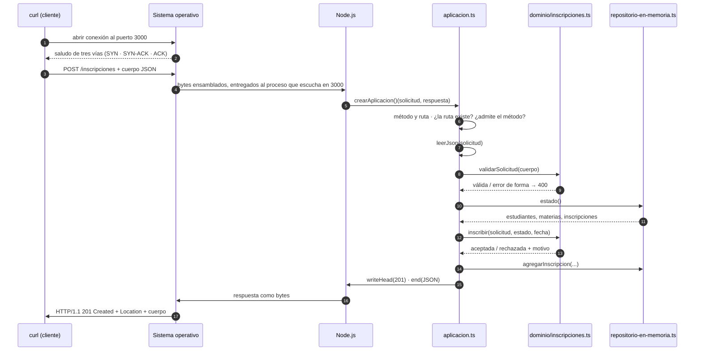
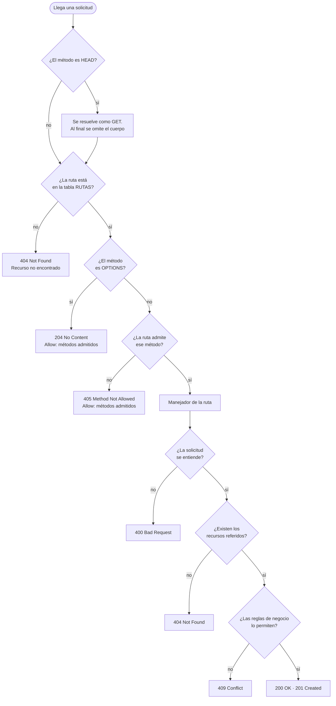
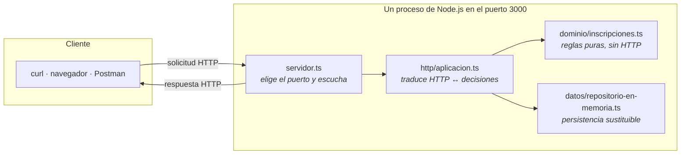
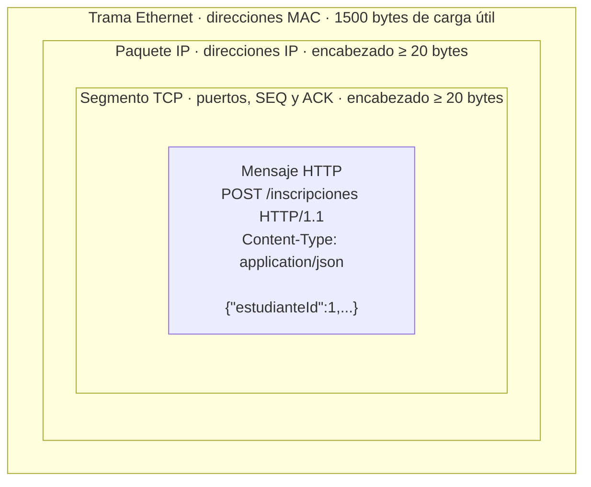

# El ciclo de una solicitud, paso a paso

Diagrama pedido por la rúbrica de la Unidad 1. Todo lo que sigue describe este
servidor, no un ejemplo genérico: los nombres de archivo y de función son los que
están en `src/`.

## 1. Del comando a la respuesta

El dominio nunca ve un objeto de HTTP: recibe datos y devuelve una decisión. La
capa HTTP traduce esa decisión a un código de estado. Por eso las reglas se pueden
probar sin levantar un servidor.

## 2. Cómo decide la capa HTTP qué responder

La diferencia entre los cuatro errores es la pregunta que ya se pudo responder:

| Código | Lo que el servidor pudo determinar |
| ------ | ---------------------------------- |
| `400`  | No entiendo la solicitud: falta un campo o el JSON está roto. |
| `404`  | La entiendo, pero eso que nombrás no existe. |
| `405`  | Existe el recurso, pero no admite esa operación. Va con `Allow`. |
| `409`  | Existe todo y la entiendo, pero el estado actual no la admite. |

## 3. Dónde vive cada cosa

`servidor.ts` no contiene ninguna conducta: sólo elige el puerto y escucha. Todo lo
demás está en `crearAplicacion()`, que las pruebas usan sin abrir el puerto 3000.
Ese es el motivo del refactor de la primera clase y está en `BITACORA-TDD.md`.

## 4. Las capas por debajo de HTTP

Lo que `curl` envía como una línea de texto viaja encajado en tres sobres:

Cada capa agrega su encabezado y trata a la de arriba como carga útil. TCP garantiza
que los bytes lleguen completos y en orden, pero **no dice dónde termina un mensaje**:
eso lo resuelve HTTP con `Content-Length`. Por eso todas las respuestas de este
servidor lo declaran, y por eso `HEAD` puede informar el tamaño sin enviar el cuerpo.

En una captura sobre la interfaz `lo` —cliente y servidor en la misma máquina— la
capa Ethernet no aparece: no hay placa de red de por medio. Para verla hay que
capturar en la placa real, como explica [`demo/GUION-DEMO.md`](demo/GUION-DEMO.md).
